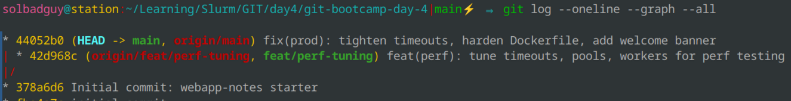
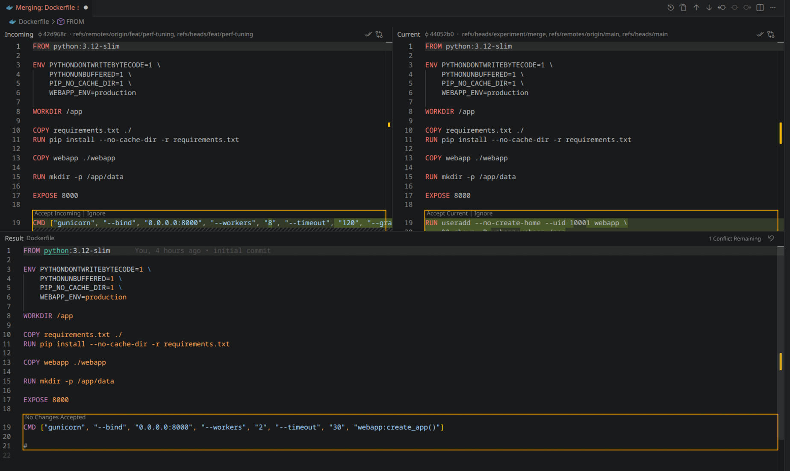
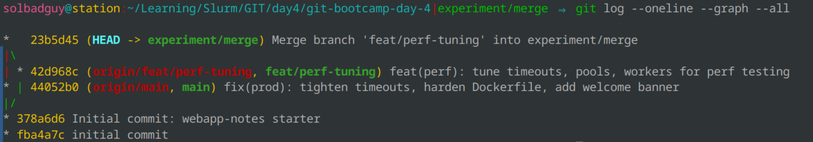
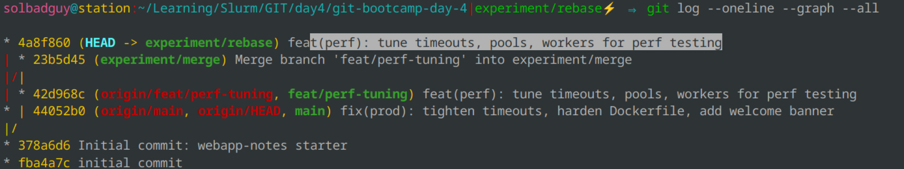
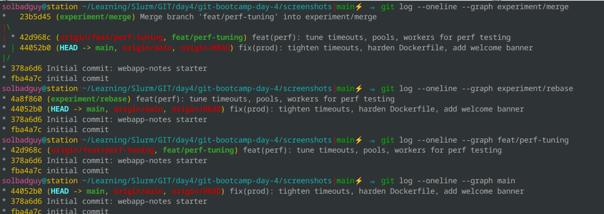

# LAB — день 4

> Это шаблон отчёта. Скопируйте его в `LAB.md` в корне вашего репозитория с ДЗ и заполните по ходу работы. Достаточно осмысленных заголовков, code-блоков с языком и ссылок на скриншоты.

Курс: [«Интенсив по погружению в GIT»](https://slurm.io/git-intensive)


## Базовая задача — `01-merge-vs-rebase`

### Стартовое состояние

Создал пустой репозиторий, скопировал в него файлы проекта, создал новую ветку изменил там файлы в соотв с заданием, после изменил файлы в основной ветке. Все это сделано ради воспроизведения конфликта

```bash
# git log --oneline --graph --all (на момент окончания подготовки)
```



### Путь A — через `merge`

Все конфликты решал через VS Code Merge Editor, к моему удивлению это было очень удобно, варианты которые оставить выбирал случайно

```bash
# ключевые команды
```





### Путь B — через `rebase`

Как и в варианте А, решал все конфликты через VS Code Merge Editor

```bash
# ключевые команды
```



### Сравнение

Финальная история всех веток рядом:



ПРи мерже размер истории больше и она не такая "чистая", с другой стороны это удобно если требуется отследить разработку какой-то фичи.

### Какой подход я бы выбрал(а) в команде и почему

Для командной работы и слияния своих наработок в main выбираем merge

Для обновления своей ветки перед пул реквестом или для работы с личным репо выбираем rebase

## Задания со звездочкой (опционально)
> это заполняете только если делали. иначе не включайте в отчет и удалите их шаблона

### ⭐1 — `git pull` vs `git pull --rebase`

Что было воспроизведено, какая разница в истории получилась, какую глобальную настройку поставили в `~/.gitconfig`.


### ⭐2 — `--force-with-lease` vs `--force`

Что было сделано (`git commit --amend` после push), почему обычный `git push` отказал, чем `--force-with-lease` безопаснее `--force`.


### ⭐3 — rebase с конфликтом на каждом коммите

Сюжет, через сколько `--continue` прошли, что почувствовали по сравнению с пассивным merge.


### ⭐4 — безопасный выход из detached HEAD

Как зашли в detached HEAD, какой коммит сделали, как выходили через `git switch -c`, чем `git reflog` помог как страховка.


